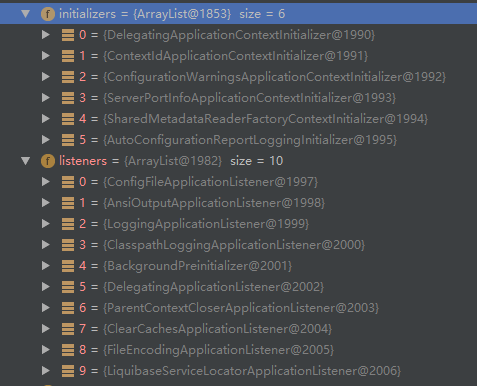

# 入口
```java
@SpringBootApplication
public class SpringbootstarterApplication {

	public static void main(String[] args) {
		SpringApplication.run(SpringbootstarterApplication.class, args);
	}
}
```
<!-- more -->
# 初始化
```java
private void initialize(Object[] sources) {
    //sources为入口的传入的class
    if (sources != null && sources.length > 0) {
        this.sources.addAll(Arrays.asList(sources));
    }
    //是否web应用
    this.webEnvironment = deduceWebEnvironment();
    //设置初始化器
    setInitializers((Collection) getSpringFactoriesInstances(
            ApplicationContextInitializer.class));
    //设置监听器
    setListeners((Collection) getSpringFactoriesInstances(ApplicationListener.class));
    this.mainApplicationClass = deduceMainApplicationClass();
}
```
加载的初始化器和监听器如下：


# 运行
```java
public ConfigurableApplicationContext run(String... args) {
    StopWatch stopWatch = new StopWatch();
    stopWatch.start();
    ConfigurableApplicationContext context = null;
    FailureAnalyzers analyzers = null;
    configureHeadlessProperty();
    //SpringApplicationRunListener监听事件：
    //starting, environmentPrepared, contextPrepared, contextLoaded, finished 
    SpringApplicationRunListeners listeners = getRunListeners(args);
    listeners.starting();
    try  {
        ApplicationArguments applicationArguments = new DefaultApplicationArguments(
                args);
        ConfigurableEnvironment environment = prepareEnvironment(listeners,
                applicationArguments);
        Banner printedBanner = printBanner(environment);
        context = createApplicationContext();
        analyzers = new FailureAnalyzers(context);
        //初始化一些配置
        prepareContext(context, environment, listeners, applicationArguments,
                printedBanner);
        refreshContext(context);
        afterRefresh(context, applicationArguments);
        listeners.finished(context, null);
        stopWatch.stop();
        if (this.logStartupInfo) {
            new StartupInfoLogger(this.mainApplicationClass)
                    .logStarted(getApplicationLog(), stopWatch);
        }
        return context;
    }
    catch (Throwable ex) {
        handleRunFailure(context, listeners, analyzers, ex);
        throw new IllegalStateException(ex);
    }
}
```