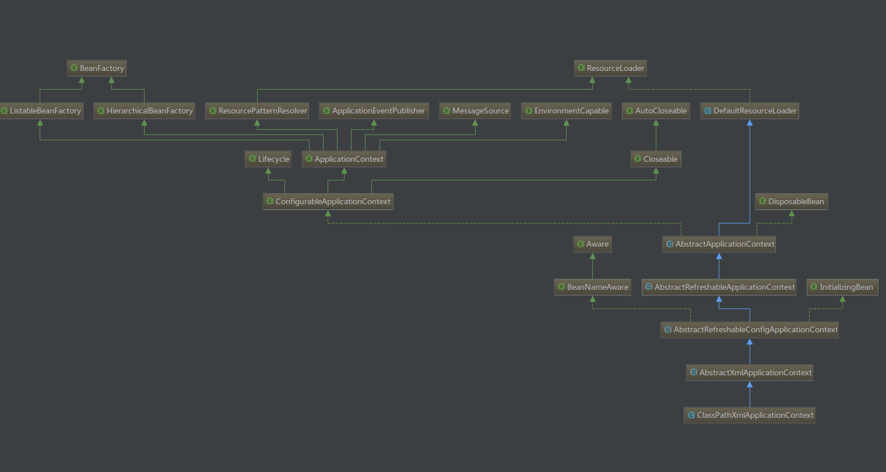

### 什么是IoC

> [透彻理解IoC](http://stamen.iteye.com/blog/1489223/)

一个完整的程序必然需要多个对象的协作才能完成，每个对象都需要引用与其合作的对象（即依赖的对象）。如果这种依赖关系都靠自身实现，那么程序将充斥着各式各样的对象创建构造的无关业务的代码，也将导致代码高度耦合。所谓IoC（依赖控制反转）就是将管理这种依赖关系的职责从具体对象中抽离出来，交由IoC容器来管理。spring作为一个框架所提供的最核心的功能就是IoC容器。它可以为我们管理对象的创建构造销毁等生命周期，可以通过配置文件、注解等方式方便的实现依赖注入。

### Spring IoC 初探

一个最简单的例子：
```java
ApplicationContext applicationContext = new ClassPathXmlApplicationContext("applicationContext.xml");
Person person1 = applicationContext.getBean("person1", Person.class);
```
以上代码的作用就是从类的资源路径中读取配置文件，初始化容器，并获取到一个Person对象。

让我们看一下 `ClassPathXmlApplicationContext` 这个类的继承层次：


