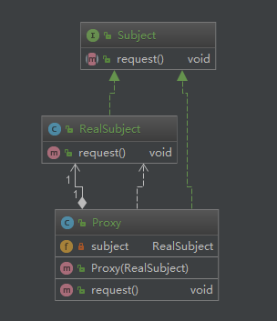

# 静态代理



<!-- more -->

```java
public interface Subject {
    void request();
}

public interface Subject {
    void request();
}

public class Proxy implements Subject{

    private RealSubject subject;

    public Proxy(RealSubject subject) {
        this.subject = subject;
    }

    @Override
    public void request() {
        //在调用目标对象方法之前，执行一些功能处理
        subject.request();
        //在调用目标对象方法之后，执行一些功能处理
    }
}
```

# 动态代理（Java动态代理）

```java
public class DynamicProxy implements InvocationHandler{

    private Subject subject;

    public Subject getInstance(Subject subject) {
        this.subject =  subject;
        return (Subject) Proxy.newProxyInstance(subject.getClass().getClassLoader(), subject.getClass().getInterfaces(), this);
    }

    @Override
    public Object invoke(Object proxy, Method method, Object[] args) throws Throwable {
        //在调用目标对象方法之前，执行一些功能处理
        return method.invoke(proxy, args);
        //在调用目标对象方法之后，执行一些功能处理
    }
}

public class Client {
    public static void main(String[] args){
        Subject subject = new RealSubject();
        new DynamicProxy().getInstance(subject).request();
    }
}
```