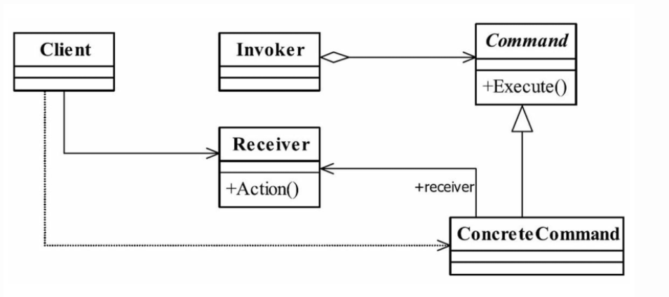

<!-- more -->

优点：
- command子类可以快速扩展
- 调用者和接收者间解耦，调用者只需要调用command的execute方法，不需要了解接收者

```java
//通用Receiver类
public abstract class Receiver {
    public abstract void doSomething();
}

//具体Receiver类
public class ConcreteReciver1 extends Receiver{ 
    //每个接收者都必须处理一定的业务逻辑 
    public void doSomething(){ } 
} 
public class ConcreteReciver2 extends Receiver{ 
    //每个接收者都必须处理一定的业务逻辑 
    public void doSomething(){ } 
}

//抽象Command类
public abstract class Command {
    public abstract void execute();
}

//具体的Command类
public class ConcreteCommand1 extends Command { 
    //对哪个Receiver类进行命令处理 
    private Receiver receiver; 
    //构造函数传递接收者 
    public ConcreteCommand1(Receiver _receiver){
        this.receiver = _receiver; 
    } 

    //必须实现一个命令 
    public void execute() { 
    //业务处理 
        this.receiver.doSomething(); 
    } 
} 

public class ConcreteCommand2 extends Command { 
    //哪个Receiver类进行命令处理 
    private Receiver receiver; 
    //构造函数传递接收者 
    public ConcreteCommand2(Receiver _receiver){
        this.receiver = _receiver; 
    } 
    //必须实现一个命令 
    public void execute() { 
        //业务处理 
        this.receiver.doSomething();
    } 
}

//调用者Invoker类
public class Invoker {
    private Command command;
    
    public void setCommand(Command _command){
        this.command = _command;
    }
    
    public void action() {
        this.command.execute();
    }
}

//场景类
public class Client {
    public static void main(String[] args){
        Invoker invoker = new Invoker();
        Receiver receiver = new ConcreteReceiver1();
        
        Command command = new ConcreteCommand1(receiver);
        invoker.setCommand(command);
        invoker.action();
    }
}
```
