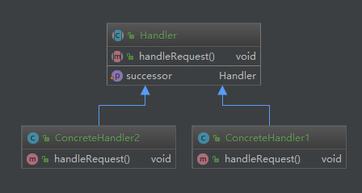

<!-- more -->
```java
/**
 * 职责接口
 * @author LinChangyi
 * @date 2018/2/13
 **/
public abstract class Handler {
    /**
     * 持有后继的职责对象
     */
    protected Handler successor;

    public void setSuccessor(Handler successor) {
        this.successor = successor;
    }

    /**
     * 处理请求的方法
     * 可以根据需求传入参数
     */
    public abstract void handleRequest();
}


/**
 * @author LinChangyi
 * @date 2018/2/13
 **/
public class ConcreteHandler1 extends Handler{
    @Override
    public void handleRequest() {
        //根据某些条件来判断是否属于自己的职责范围
        //判断条件比如，从外部传入的参数，或者这里主动去获取的外部数据
        //如从数据库中获取等，下面只是个示意
        boolean someCondition = false;

        if(someCondition){
            //属于自己的职责
            System.out.println("ConcreteHandler1 handle request");
        } else {
            if(this.successor!=null){
                this.successor.handleRequest();
            }
        }
    }
}


/**
 * @author LinChangyi
 * @date 2018/2/13
 **/
public class Client {
    public static void main(String[] args){
        //组装责任链
        Handler handler1 = new ConcreteHandler1();
        Handler handler2 = new ConcreteHandler2();

        handler1.setSuccessor(handler2);

        //提交请求
        handler1.handleRequest();
    }
}
```